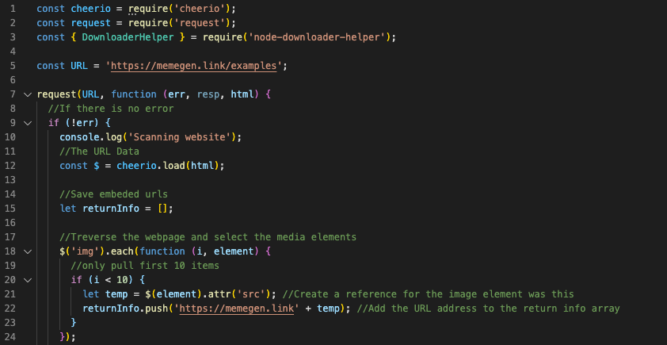

# Memescraper

## node.js meme scraper/downloader

Created in Sept 2020 by _Jenna Koelbl_

**Scraping program to download memes from any url site.**

- Scans website of provided url and pulls the info of the first 10 images on the site.
- Takes those 10 links and downloads them into meme file
- Uses 3 imported libraries: cheerio, request, node-download-helper

Run code in terminal: `node index.js`

### REPL:

https://repl.it/@jaylenej27/memescraper#.replit

#### Screenshot

## Libraries

https://cheerio.js.org/
https://github.com/request/request
https://www.npmjs.com/package/node-downloader-helper
